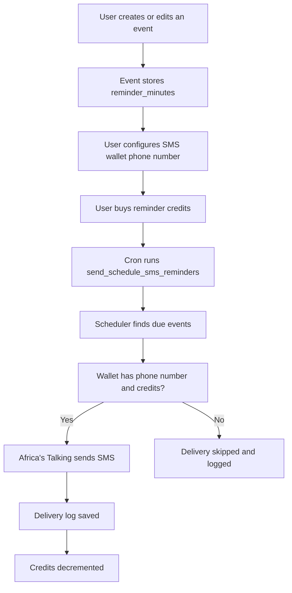

# Schedule SMS Reminders

This guide explains the SMS reminder feature in the schedule app end to end.

The goal is simple: when a class or exam is coming up, Kibegi can send a reminder SMS so students do not miss it.

## Why This Exists

Students often miss classes because they rely on memory or app notifications only. SMS is useful because:

- it works on basic phones
- it reaches users even when they are not in the app
- it is suitable for urgent reminders shortly before class starts
- it can be billed separately from storage or profile usage

## High-Level Flow



## What Gets Sent

The reminder message is built from the stored event details. A typical message looks like this:

```text
Kibegi reminder: Linear Algebra | starts on Fri, 01 May 2026 at 09:00 AM | Location: Room 4B
```

The exact formatting is handled in the backend so the frontend does not need to assemble SMS text.

## Data Stored for SMS

### `ScheduleSmsAccount`

This model stores the wallet for the schedule owner.

Important fields:

- `owner`: the authenticated user who owns the wallet
- `phone_number`: destination phone for reminders
- `balance_credits`: remaining reminder credits
- `provider_name`: currently `africastalking`
- `sender_id`: optional provider sender label
- `is_active`: toggle to disable reminders without deleting the wallet
- `last_topup_reference`: optional top-up audit reference
- `last_topup_at`: when the wallet was last funded

### `ScheduleSmsDeliveryLog`

This model records every reminder attempt.

Important fields:

- `event`: the schedule event being reminded
- `sms_account`: the wallet used for the send attempt
- `recipient_phone`: destination phone number at the time of sending
- `status`: `pending`, `sent`, `failed`, or `skipped`
- `message`: the message body that was attempted
- `credits_used`: credits consumed by the reminder
- `provider_message_id`: provider-side message reference when available
- `provider_response`: raw provider response for audit
- `error_message`: why a send failed or was skipped
- `sent_at`: timestamp used for the attempt

## API For The Frontend

### Read Wallet

```http
GET /api/v1/schedule/sms-account/
Authorization: Bearer <JWT>
```

Use this to show the current phone number and credits.

### Update Wallet

```http
PATCH /api/v1/schedule/sms-account/
Authorization: Bearer <JWT>
Content-Type: application/json
```

Example payload:

```json
{
  "phone_number": "+254700000000",
  "sender_id": "KIBEGI"
}
```

The wallet endpoint intentionally does not expose credit purchase logic yet. It only manages the reminder destination and metadata.

## Command That Sends Reminders

The reminder worker is a Django management command:

```bash
./.venv/bin/python manage.py send_schedule_sms_reminders
```

Options:

- `--dry-run` checks what would be sent without calling the SMS provider or charging credits
- `--limit N` processes only the first N due reminders

The command is designed for cron, systemd timers, GitHub Actions, or any other scheduler that can run a shell command on a fixed interval.

## How The Scheduler Decides What To Send

The backend looks for events whose reminder window is currently due.

The important inputs are:

- `event.start_at`
- `event.reminder_minutes`
- `SCHEDULE_SMS_GRACE_MINUTES`
- `SCHEDULE_SMS_LOOKAHEAD_DAYS`

The reminder is considered due when the current time falls inside the event's reminder window. This gives a small grace window so the job does not miss a message because it started a little late.

## Africa's Talking Integration

The backend sends SMS with the Africa's Talking messaging API.

Required settings:

```env
AFRICASTALKING_USERNAME=
AFRICASTALKING_API_KEY=
AFRICASTALKING_SENDER_ID=
AFRICASTALKING_SMS_URL=https://api.africastalking.com/version1/messaging
```

How the request is built:

- `username` is sent as form data
- `to` is the recipient phone number
- `message` is the reminder text
- `from` is sent when a sender id is configured
- `apiKey` is sent in the request headers

The provider adapter uses the Python standard library, so no extra HTTP client package is required.

## Credits

SMS credits are independent of storage and other platform quotas.

Current behaviour:

- one SMS reminder consumes one credit by default
- credits are deducted only after a successful provider send
- if credits are missing, the reminder is logged as `skipped`
- if the wallet is inactive, the reminder is logged as `skipped`
- if the phone number is missing, the reminder is logged as `skipped`

Suggested top-up model later:

- sell credits in bundles, for example 10, 50, or 100 reminders
- store a top-up payment reference in `last_topup_reference`
- increase `balance_credits` when payment is confirmed

## Cron Example

Run the command every minute:

```cron
* * * * * cd /home/cameltech/Projects/KiBEGI/API && ./.venv/bin/python manage.py send_schedule_sms_reminders >> /home/cameltech/Projects/KiBEGI/API/logs/schedule-sms.log 2>&1
```

For a safe dry run:

```bash
./.venv/bin/python manage.py send_schedule_sms_reminders --dry-run
```

## Admin Monitoring

You can monitor reminder activity in the Django admin:

- SMS account balance per user
- all delivery attempts
- credits spent per reminder
- provider response for successful sends
- failure messages for skipped or failed attempts

## What The Frontend Should Do

The frontend does not send SMS directly. It should:

- collect and save the user's phone number in the SMS wallet screen
- display the current credit balance
- inform the user that reminders are credit-based
- let the user know when the wallet is inactive or out of credits
- offer a clear CTA to top up credits when that flow is added later

## Failure Cases

Common reasons a reminder will not send:

- no phone number saved
- no credits available
- Africa's Talking credentials missing or invalid
- event falls outside the reminder window
- the scheduler did not run on time

Every failure or skip is recorded in the delivery log so support can inspect what happened later.

## Developer Validation

Use the schedule test slice to verify the feature:

```bash
./.venv/bin/python manage.py test apps.schedule.tests --settings=kibegi_api.test_settings
```

Those tests cover:

- wallet read/update
- reminder send success
- insufficient-credit skip handling
- event scheduling and existing calendar behaviour

## Related Files

- [apps/schedule/README.md](README.md)
- [apps/schedule/services.py](services.py)
- [apps/schedule/models.py](models.py)
- [apps/schedule/management/commands/send_schedule_sms_reminders.py](management/commands/send_schedule_sms_reminders.py)